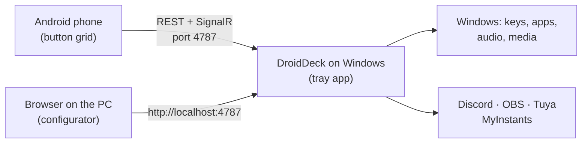

<div align="center">


# DroidDeck

**Turn an Android phone into a Stream Deck for your Windows PC.**

**English** · [Português](README.pt-BR.md)

[](https://github.com/ggfto/DroidDeck/stargazers)
[](https://github.com/ggfto/DroidDeck/releases/latest)
[](https://github.com/ggfto/DroidDeck/releases)
[](https://github.com/ggfto/DroidDeck/actions/workflows/ci.yml)
[](LICENSE)

[**Download**](https://github.com/ggfto/DroidDeck/releases/latest) ·
[**Website**](https://me.gf2.in/DroidDeck/) ·
[**Documentation**](https://me.gf2.in/DroidDeck/docs/)

</div>

---

Set up a grid of buttons on your phone that fire shortcuts, open apps, control audio and media, drive
Discord and OBS, play sounds and switch your smart lights. The PC side is a small tray app; the phone
talks to it over your local network.

## ✨ Features

| | |
|---|---|
| ⌨️ **Shortcuts & apps** | Send key combinations, open programs, files and URLs, chain steps in a multi-action. |
| 🔊 **Audio mixer** | Mute apps, change device volume, toggle the mic. The phone also has a full per-app mixer. |
| ⏯️ **Media** | Play/pause, next, previous for whatever is playing in Windows (Spotify, browser, players). |
| 📊 **Live monitors** | CPU, GPU, RAM and network gauges that update every second. |
| 💬 **Discord** | Mute/deafen, join channels, voice volume, push-to-talk, per-user volume, native soundboard. |
| 🎥 **OBS Studio** | Scenes, recording, streaming, virtual camera, replay buffer, mute sources — with live state. |
| 🎵 **Soundboard** | Search and play sounds from MyInstants, routed to your mic through VB-Cable. |
| 💡 **Smart home** | Tuya / Smart Life lights, plugs and switches — toggles, dimmers and colours, with real state. |

## 🚀 Getting started

**Requirements:** Windows 10 1809+ (64-bit) · Android 7.0+ · phone and PC on the same local network.

1. **Windows** — download `DroidDeck-win-x64.zip` from the [latest release](https://github.com/ggfto/DroidDeck/releases/latest),
   extract it and run `DroidDeck.exe`. It lives in the system tray. No .NET install needed.
2. **Android** — install `DroidDeck.apk` from the same release.
3. **Pair** — right-click the tray icon → **Parear dispositivo (QR)…** and scan the code with the app.
4. **Configure** — open `http://localhost:4787/` on the PC to edit your buttons. Changes show up on the phone instantly.

> [!NOTE]
> The app interface is currently in Portuguese. The [documentation](https://me.gf2.in/DroidDeck/docs/)
> is available in English and Portuguese.

Having trouble (SmartScreen, firewall, phone not finding the PC)? See
[Installation](https://me.gf2.in/DroidDeck/docs/getting-started/installation/) and
[Troubleshooting](https://me.gf2.in/DroidDeck/docs/troubleshooting/).

## 🔌 Integrations

| Integration | Guide |
|---|---|
| Discord (uses your own Discord app — ~2 min setup) | [Discord](https://me.gf2.in/DroidDeck/docs/integrations/discord/) |
| OBS Studio (obs-websocket) | [OBS Studio](https://me.gf2.in/DroidDeck/docs/integrations/obs/) |
| Soundboard (MyInstants + VB-Cable) | [Soundboard](https://me.gf2.in/DroidDeck/docs/integrations/soundboard/) |
| Tuya / Smart Life (Nova Digital, Positivo, RSmart, Elgin…) | [Smart home](https://me.gf2.in/DroidDeck/docs/integrations/tuya/) |
| Per-app mixer & media | [Mixer & media](https://me.gf2.in/DroidDeck/docs/integrations/mixer-media/) |

## 🧩 How it works



This is a monorepo with both halves of the project, which evolve together:

```
DroidDeck/
  RaspDeck/   C# backend (.NET 8 / WinForms tray + ASP.NET Core + SignalR). Serves the API and the web configurator.
  app/        Flutter app: phone runtime + web configurator (same codebase).
  tests/      Backend tests.
  scripts/    Utilities (deploy the web build to wwwroot).
  website/    Landing page + documentation (MkDocs, EN/PT) published to GitHub Pages.
```

App and backend share a contract: **REST** (`/api/...`), **SignalR** (`/deckHub`) and **UDP discovery**
(port 7573), authenticated with an API key obtained through QR pairing.

## 🛠️ Building from source

```powershell
# Backend: tray app + web server at http://localhost:4787
dotnet run --project RaspDeck

# Web configurator: flutter build web + copy to RaspDeck/wwwroot
.\scripts\deploy-web.ps1

# Android APK
cd app
flutter build apk --debug --target-platform android-arm64
```

Backend modes: default (tray), `--headless` (server only), `--print-pairing` (prints the pairing URI/QR and exits).

Full details — architecture, tests, releases with semantic-release — in
[Architecture](https://me.gf2.in/DroidDeck/docs/developers/architecture/) and
[Building from source](https://me.gf2.in/DroidDeck/docs/developers/building/).

## 🤝 Contributing

Issues and pull requests are welcome. Commits follow [Conventional Commits](https://www.conventionalcommits.org/)
(`feat:`, `fix:`, …), since releases and the changelog are generated from them.

If DroidDeck is useful to you, consider leaving a ⭐ — it helps the project reach more people.

## ⭐ Star history

<a href="https://star-history.com/#ggfto/DroidDeck&Date">
  <picture>
    <source media="(prefers-color-scheme: dark)" srcset="https://api.star-history.com/svg?repos=ggfto%2Fdroiddeck&type=Date&theme=dark">
    
  </picture>
</a>

## 📄 License

[Apache License 2.0](LICENSE).
