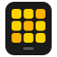
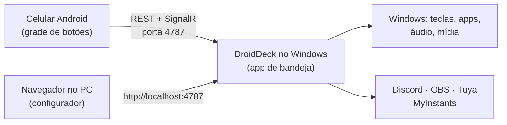

<div align="center">



# DroidDeck

**Transforme um celular Android em um Stream Deck para o seu PC com Windows.**

[English](README.md) · **Português**

[](https://github.com/ggfto/DroidDeck/stargazers)
[](https://github.com/ggfto/DroidDeck/releases/latest)
[](https://github.com/ggfto/DroidDeck/releases)
[](https://github.com/ggfto/DroidDeck/actions/workflows/ci.yml)
[](LICENSE)

[**Baixar**](https://github.com/ggfto/DroidDeck/releases/latest) ·
[**Site**](https://me.gf2.in/DroidDeck/) ·
[**Documentação**](https://me.gf2.in/DroidDeck/docs/pt/)

</div>

---

Monte uma grade de botões no celular que disparam atalhos, abrem apps, controlam áudio e mídia,
comandam o Discord e o OBS, tocam sons e acendem suas lâmpadas inteligentes. No PC roda um pequeno
app na bandeja do sistema; o celular conversa com ele pela rede local.

## ✨ Recursos

| | |
|---|---|
| ⌨️ **Atalhos e apps** | Envie combinações de teclas, abra programas, arquivos e URLs, encadeie passos em uma multiação. |
| 🔊 **Mixer de áudio** | Silencie apps, ajuste o volume de dispositivos, ligue e desligue o microfone. O celular também tem um mixer completo por app. |
| ⏯️ **Mídia** | Tocar/pausar, próxima e anterior para o que estiver tocando no Windows (Spotify, navegador, players). |
| 📊 **Monitores ao vivo** | Medidores de CPU, GPU, RAM e rede atualizados a cada segundo. |
| 💬 **Discord** | Silenciar/ensurdecer, entrar em canais, volume de voz, push-to-talk, volume por usuário, soundboard nativo. |
| 🎥 **OBS Studio** | Cenas, gravação, transmissão, câmera virtual, replay buffer, silenciar fontes — com estado ao vivo. |
| 🎵 **Soundboard** | Busque e toque sons do MyInstants, enviados para o seu microfone pelo VB-Cable. |
| 💡 **Casa inteligente** | Lâmpadas, tomadas e interruptores Tuya / Smart Life — liga/desliga, brilho e cores, com estado real. |

## 🚀 Começando

**Requisitos:** Windows 10 1809+ (64 bits) · Android 7.0+ · celular e PC na mesma rede local.

1. **Windows** — baixe o `DroidDeck-win-x64.zip` da [versão mais recente](https://github.com/ggfto/DroidDeck/releases/latest),
   descompacte e rode o `DroidDeck.exe`. Ele fica na bandeja do sistema. Não precisa instalar o .NET.
2. **Android** — instale o `DroidDeck.apk` da mesma release.
3. **Parear** — clique com o botão direito no ícone da bandeja → **Parear dispositivo (QR)…** e escaneie o código com o app.
4. **Configurar** — abra `http://localhost:4787/` no PC para editar seus botões. As mudanças aparecem no celular na hora.

Algum problema (SmartScreen, firewall, celular não encontra o PC)? Veja
[Instalação](https://me.gf2.in/DroidDeck/docs/pt/getting-started/installation/) e
[Solução de problemas](https://me.gf2.in/DroidDeck/docs/pt/troubleshooting/).

## 🔌 Integrações

| Integração | Guia |
|---|---|
| Discord (usa o seu próprio app do Discord — setup de ~2 min) | [Discord](https://me.gf2.in/DroidDeck/docs/pt/integrations/discord/) |
| OBS Studio (obs-websocket) | [OBS Studio](https://me.gf2.in/DroidDeck/docs/pt/integrations/obs/) |
| Soundboard (MyInstants + VB-Cable) | [Soundboard](https://me.gf2.in/DroidDeck/docs/pt/integrations/soundboard/) |
| Tuya / Smart Life (Nova Digital, Positivo, RSmart, Elgin…) | [Casa inteligente](https://me.gf2.in/DroidDeck/docs/pt/integrations/tuya/) |
| Mixer por app e mídia | [Mixer e mídia](https://me.gf2.in/DroidDeck/docs/pt/integrations/mixer-media/) |

## 🧩 Como funciona



Monorepo com as duas metades do projeto, que evoluem juntas:

```
DroidDeck/
  RaspDeck/   Backend C# (.NET 8 / WinForms tray + ASP.NET Core + SignalR). Serve a API e o configurador web.
  app/        App Flutter: runtime no celular + configurador web (mesmo código).
  tests/      Testes do backend.
  scripts/    Utilitários (deploy do web para o wwwroot).
  website/    Landing page + documentação (MkDocs, EN/PT) publicadas no GitHub Pages.
```

O app e o backend compartilham um contrato: **REST** (`/api/...`), **SignalR** (`/deckHub`) e
**discovery UDP** (porta 7573), autenticados por uma API key obtida no pareamento por QR.

## 🛠️ Compilando do código-fonte

```powershell
# Backend: app de bandeja + servidor web em http://localhost:4787
dotnet run --project RaspDeck

# Configurador web: flutter build web + copia para RaspDeck/wwwroot
.\scripts\deploy-web.ps1

# APK Android
cd app
flutter build apk --debug --target-platform android-arm64
```

Modos do backend: padrão (bandeja), `--headless` (só servidor), `--print-pairing` (imprime a URI/QR de pareamento e sai).

Detalhes completos — arquitetura, testes, releases com semantic-release — em
[Arquitetura](https://me.gf2.in/DroidDeck/docs/pt/developers/architecture/) e
[Compilando do código-fonte](https://me.gf2.in/DroidDeck/docs/pt/developers/building/).

## 🤝 Contribuindo

Issues e pull requests são bem-vindos. Os commits seguem [Conventional Commits](https://www.conventionalcommits.org/pt-br/)
(`feat:`, `fix:`, …), porque as releases e o changelog são gerados a partir deles.

Se o DroidDeck te ajuda, deixe uma ⭐ — isso ajuda o projeto a chegar em mais gente.

## ⭐ Histórico de estrelas

<a href="https://star-history.com/#ggfto/DroidDeck&Date">
  <picture>
    <source media="(prefers-color-scheme: dark)" srcset="https://api.star-history.com/svg?repos=ggfto%2Fdroiddeck&type=Date&theme=dark">
    
  </picture>
</a>

## 📄 Licença

[Apache License 2.0](LICENSE).
