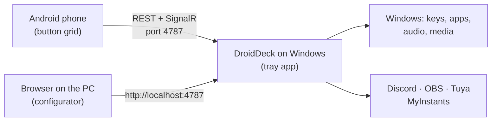

# DroidDeck

**DroidDeck turns an Android phone into a Stream Deck for your Windows PC.** Set up a grid of buttons
on your phone that fire shortcuts, open apps, control audio and media, drive Discord and OBS, play
sounds, and switch your smart lights. The PC side is a small tray app; the phone talks to it over your
local network.

[Download the latest release :material-download:](https://github.com/ggfto/DroidDeck/releases/latest){ .md-button .md-button--primary }
[Get started](getting-started/installation.md){ .md-button }

## What you can do

| | |
|---|---|
| :material-keyboard: **Shortcuts & apps** | Send key combinations, open programs, files and URLs, chain steps in a multi-action. |
| :material-volume-high: **Audio mixer** | Mute apps, change device volume, toggle the mic. The phone also has a full per-app mixer. |
| :material-play-pause: **Media** | Play/pause, next, previous for whatever is playing in Windows (Spotify, browser, players). |
| :material-chart-donut: **Live monitors** | CPU, GPU, RAM and network gauges that update every second. |
| :simple-discord: **Discord** | Mute/deafen, join channels, voice volume, push-to-talk, per-user volume, native soundboard. |
| :simple-obsstudio: **OBS Studio** | Scenes, recording, streaming, virtual camera, replay buffer, mute sources, with live state. |
| :material-music-box-multiple: **Soundboard** | Search and play sounds from MyInstants, routed to your mic through VB-Cable. |
| :material-lightbulb-on: **Smart home** | Tuya / Smart Life lights, plugs and switches — toggles, dimmers and colours, with real state. |

## How it works

1. **DroidDeck for Windows** runs in the system tray and serves an API and the web configurator on port `4787`.
2. **The Android app** pairs once by scanning a QR code, then shows your buttons full screen.
3. **The configurator** runs in the PC's browser: drag buttons around, pick actions, colours and icons.
   Changes appear on the phone immediately.

## Requirements

- Windows 10 version 1809 or later (64-bit). No .NET installation needed.
- Android 7.0 or later.
- Phone and PC on the same local network.

!!! note "Language"
    The app interface is currently in Portuguese, with a few English labels. This documentation is
    available in English and Portuguese — use the language selector at the top.
