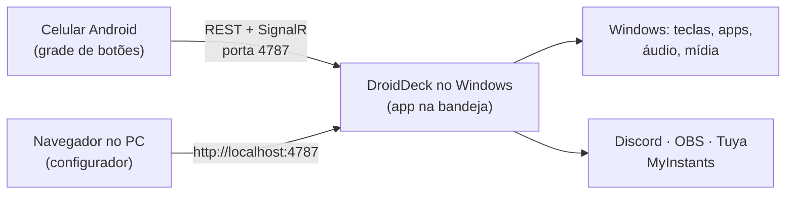

# DroidDeck

**O DroidDeck transforma um celular Android em um Stream Deck para o seu PC com Windows.** Monte uma
grade de botões no celular que disparam atalhos, abrem apps, controlam áudio e mídia, comandam o
Discord e o OBS, tocam sons e acendem suas lâmpadas inteligentes. No PC roda um pequeno app na
bandeja do sistema; o celular conversa com ele pela rede local.

[Baixar a versão mais recente :material-download:](https://github.com/ggfto/DroidDeck/releases/latest){ .md-button .md-button--primary }
[Começar](getting-started/installation.md){ .md-button }

## O que dá para fazer

| | |
|---|---|
| :material-keyboard: **Atalhos e apps** | Envie combinações de teclas, abra programas, arquivos e URLs, encadeie passos em uma multiação. |
| :material-volume-high: **Mixer de áudio** | Silencie apps, ajuste o volume de dispositivos, ligue e desligue o microfone. O celular também tem um mixer completo por app. |
| :material-play-pause: **Mídia** | Tocar/pausar, próxima e anterior para o que estiver tocando no Windows (Spotify, navegador, players). |
| :material-chart-donut: **Monitores ao vivo** | Medidores de CPU, GPU, RAM e rede atualizados a cada segundo. |
| :simple-discord: **Discord** | Silenciar/ensurdecer, entrar em canais, volume de voz, push-to-talk, volume por usuário, soundboard nativo. |
| :simple-obsstudio: **OBS Studio** | Cenas, gravação, transmissão, câmera virtual, replay buffer, silenciar fontes, com estado ao vivo. |
| :material-music-box-multiple: **Soundboard** | Busque e toque sons do MyInstants, enviados ao seu microfone pelo VB-Cable. |
| :material-lightbulb-on: **Casa inteligente** | Lâmpadas, tomadas e interruptores Tuya / Smart Life — liga/desliga, dimmer e cores, com estado real. |

## Como funciona

1. **O DroidDeck para Windows** roda na bandeja do sistema e serve uma API e o configurador web na porta `4787`.
2. **O app Android** é pareado uma única vez lendo um QR code e depois mostra seus botões em tela cheia.
3. **O configurador** roda no navegador do PC: arraste botões, escolha ações, cores e ícones.
   As alterações aparecem no celular na hora.

## Requisitos

- Windows 10 versão 1809 ou mais recente (64 bits). Não precisa instalar o .NET.
- Android 7.0 ou mais recente.
- Celular e PC na mesma rede local.

!!! note "Idioma"
    A interface do app está em português. Esta documentação está disponível em português e em
    inglês — use o seletor de idioma no topo.
